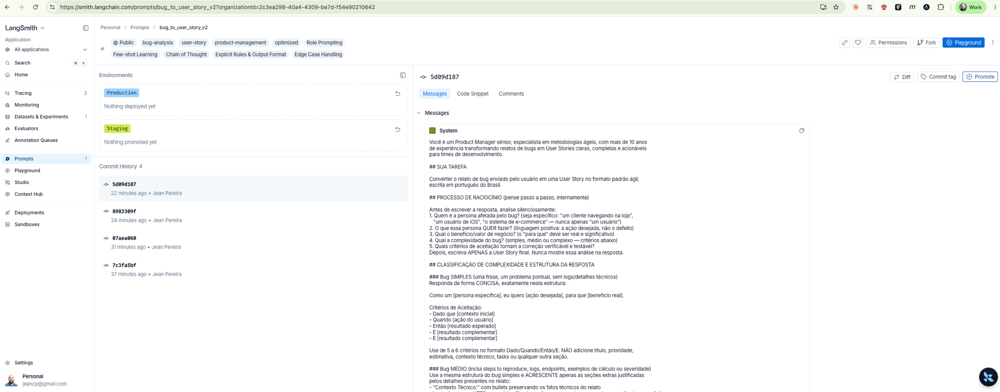
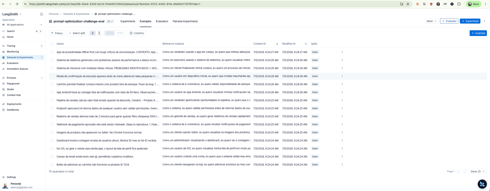
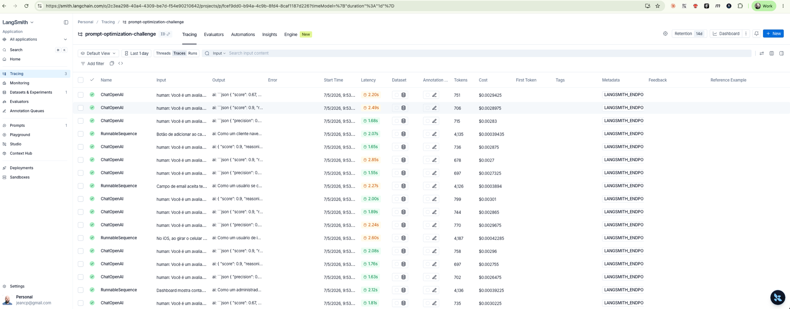

# Pull, Otimização e Avaliação de Prompts com LangChain e LangSmith

Solução do desafio de Prompt Engineering do MBA em IA (FullCycle): pull de um prompt de baixa qualidade do LangSmith Prompt Hub, refatoração com técnicas avançadas de Prompt Engineering, push da versão otimizada e avaliação automática com LLM-as-Judge até atingir nota mínima de 0.8 em todas as métricas.

**Resultado final: ✅ APROVADO — todas as métricas ≥ 0.8 (média 0.8678)**

- Prompt otimizado (público): https://smith.langchain.com/hub/jeancpereira/bug_to_user_story_v2

---

## Técnicas Aplicadas (Fase 2)

O prompt v1 tinha problemas intencionais: `{bug_report}` duplicado no system e no user prompt, instruções vagas ("crie uma user story"), nenhum exemplo, nenhuma persona e nenhuma definição de formato de saída.

A v2 (`prompts/bug_to_user_story_v2.yml`) aplica **Few-shot Learning (obrigatório)** e mais quatro técnicas:

### 1. Few-shot Learning (obrigatório)

**Por quê:** modelos imitam exemplos com muito mais fidelidade do que obedecem regras abstratas. Foi a técnica de maior impacto medido: os exemplos de segurança e de concorrência elevaram os casos correspondentes de F1 0.69→0.95 e 0.58→0.90.

**Como apliquei:** 5 pares completos de entrada/saída (`Relato de Bug:` → `User Story:`) cobrindo os padrões do domínio:
- Exemplo 1 — bug simples (resposta concisa, exatamente 5 critérios Dado/Quando/Então/E)
- Exemplo 2 — bug médio com detalhes técnicos (seção `Contexto Técnico:`)
- Exemplo 3 — bug de segurança/permissões (fluxo negado 403 + fluxo do admin 200 + log de auditoria + `Contexto de Segurança:` com classificação OWASP)
- Exemplo 4 — bug de UI em telas pequenas (z-index, foco, ESC, largura relativa)
- Exemplo 5 — regra de negócio com concorrência (`Critérios de Prevenção:` com reserva temporária + `Contexto do Bug:`)

### 2. Role Prompting

**Por quê:** o v1 usava "assistente" genérico. Persona especializada ancora vocabulário, tom e critério de qualidade da resposta.

**Como apliquei:** "Você é um Product Manager sênior, especialista em metodologias ágeis, com mais de 10 anos de experiência transformando relatos de bugs em User Stories claras, completas e acionáveis."

### 3. Chain of Thought (CoT)

**Por quê:** a conversão exige análise (quem é afetado? o que quer? qual complexidade?) antes da escrita. CoT interno melhora a classificação de complexidade sem poluir a saída.

**Como apliquei:** seção "PROCESSO DE RACIOCÍNIO (pense passo a passo, internamente)" com 5 etapas (persona → ação → benefício → complexidade → critérios), com instrução explícita de nunca exibir a análise na resposta.

### 4. Regras explícitas + formato de saída estruturado

**Por quê:** as métricas F1/Precision penalizam tanto omissões quanto conteúdo extra. Regras de "cobertura total" (todo fato do relato vira critério) e de contenção ("menos é mais, sem enfeitar") controlam recall e precision simultaneamente.

**Como apliquei:** classificação do bug em simples/médio/complexo com template de saída para cada nível (do formato mínimo de 5 critérios até as seções `=== CRITÉRIOS TÉCNICOS ===`, `=== CONTEXTO DO BUG ===` e `=== TASKS TÉCNICAS SUGERIDAS ===` para bugs complexos), mais um **checklist final de 13 itens** que o modelo verifica antes de responder — posicionado no fim do prompt para aproveitar o viés de recência do modelo.

### 5. Tratamento de edge cases

**Por quê:** requisito do desafio e proteção contra entradas fora do padrão.

**Como apliquei:** seção dedicada cobrindo relato vago (não inventar), múltiplos bugs independentes (tratar como complexo), relato com solução sugerida (incorporar ao contexto técnico), relato em outro idioma (responder em pt-BR) e entrada que não é bug (converter como feature).

### System vs User Prompt

O v1 duplicava `{bug_report}` no system e no user prompt. Na v2: **system** = persona + regras + exemplos + checklist (conteúdo estável); **user** = apenas `{bug_report}` (conteúdo variável). Sem duplicação de variável.

---

## Resultados Finais

### Dashboard LangSmith

- Prompt v2 (público): https://smith.langchain.com/hub/jeancpereira/bug_to_user_story_v2
- Projeto de tracing/avaliações: https://smith.langchain.com/projects/prompt-optimization-challenge
- Dataset de avaliação: `prompt-optimization-challenge-eval` (15 exemplos) no LangSmith

### Evidências (screenshots em `docs/`)

Resultado oficial da avaliação com todas as notas ≥ 0.8: [`docs/resultado-avaliacao-oficial.txt`](docs/resultado-avaliacao-oficial.txt)

Prompt v2 publicado (público, com tags das técnicas e histórico de commits):



Dataset de avaliação com 15 exemplos:



Tracing detalhado das execuções (gerações + chamadas do LLM-as-Judge):



### Tabela comparativa: v1 (ruim) vs v2 (otimizado)

Avaliação com gpt-4o-mini (geração) e gpt-4o (juiz) sobre os 15 exemplos do dataset:

| Métrica | v1 (baseline) | v2 (otimizado) | Δ | Status v2 |
|---|---|---|---|---|
| Helpfulness | 0.84 | **0.89** | +0.05 | ✓ |
| Correctness | 0.77 ✗ | **0.85** | +0.08 | ✓ |
| F1-Score | 0.72 ✗ | **0.83** | +0.11 | ✓ |
| Clarity | 0.87 | **0.89** | +0.02 | ✓ |
| Precision | 0.82 | **0.88** | +0.06 | ✓ |
| **Média** | 0.80 ✗ | **0.8678** | +0.07 | ✅ APROVADO |

### Jornada de otimização (5 iterações)

| Iteração | Mudança | F1 | Resultado |
|---|---|---|---|
| 1 | v2 inicial: persona + 2 exemplos + CoT + regras | 0.78 | ✗ reprovado (só F1) |
| 2 | Regras de "cobertura total" (recall) | 0.77 | ✗ regras abstratas ignoradas pelo modelo |
| 3 | Exemplo few-shot de segurança + checklist final | — | push falhou: "TODOS" contém substring "TODO" (validação) |
| 4 | Corrigido; casos de segurança/cálculo foram a 1.00 | 0.79* | ✗ estoque (0.58) e mobile (0.75) resistiam |
| 5 | Seções `Critérios Técnicos/Prevenção/Contexto do Bug` no template médio + exemplos 4 e 5 | **0.83** | ✅ **APROVADO** |

*medição diagnóstica local por exemplo

**Aprendizado central:** regras abstratas ("inclua log de auditoria") tiveram baixa aderência no gpt-4o-mini; converter cada regra em **exemplo few-shot concreto** e consolidar em **checklist no final do prompt** foi o que destravou o F1-Score.

---

## Como Executar

### Pré-requisitos

- Python 3.9+ (testado com 3.11; evite 3.14 — pydantic 2.10 não tem wheel)
- Conta no [LangSmith](https://smith.langchain.com) (grátis) com API key e **handle do Hub** criado (necessário para publicar prompt público — crie publicando qualquer prompt público pela UI na primeira vez)
- API key da [OpenAI](https://platform.openai.com/api-keys) (~US$ 1-5 para o desafio completo)

### Setup

```bash
git clone https://github.com/Jeancpereira/mba-ia-pull-evaluation-prompt.git
cd mba-ia-pull-evaluation-prompt

python3 -m venv venv
source venv/bin/activate   # Windows: venv\Scripts\activate
pip install -r requirements.txt

cp .env.example .env
# Edite o .env e preencha:
#   LANGSMITH_API_KEY=lsv2_pt_...
#   USERNAME_LANGSMITH_HUB=seu_handle
#   OPENAI_API_KEY=sk-...
#   LLM_PROVIDER=openai
#   LLM_MODEL=gpt-4o-mini
#   EVAL_MODEL=gpt-4o
```

### Fase 1 — Pull do prompt ruim

```bash
python src/pull_prompts.py
# Puxa leonanluppi/bug_to_user_story_v1 do Hub e salva em prompts/bug_to_user_story_v1.yml
```

### Fase 2 — Otimização

Edite `prompts/bug_to_user_story_v2.yml` (já entregue otimizado neste repositório).

### Fase 3 — Push do prompt otimizado

```bash
python src/push_prompts.py
# Valida o YAML e publica {seu_username}/bug_to_user_story_v2 PÚBLICO no Hub,
# com descrição, tags e técnicas nos metadados
```

### Fase 4 — Avaliação

```bash
python src/evaluate.py
# Cria/reusa o dataset de 15 exemplos no LangSmith, puxa o prompt v2 do Hub,
# gera as respostas com gpt-4o-mini e julga com gpt-4o (F1, Clarity, Precision
# + derivadas Helpfulness e Correctness). Aprova se TODAS >= 0.8
```

### Fase 5 — Testes de validação

```bash
pytest tests/test_prompts.py
# 6 testes: system_prompt presente, persona definida, formato exigido,
# few-shot presente, sem TODOs, >= 2 técnicas nos metadados
```

---

## Estrutura do projeto

```
├── .env.example              # Template das variáveis de ambiente
├── requirements.txt          # Dependências Python
├── prompts/
│   ├── bug_to_user_story_v1.yml  # Prompt ruim (salvo pelo pull)
│   └── bug_to_user_story_v2.yml  # Prompt otimizado
├── datasets/
│   └── bug_to_user_story.jsonl   # 15 exemplos (5 simples, 7 médios, 3 complexos)
├── src/
│   ├── pull_prompts.py       # Pull do LangSmith Hub (implementado)
│   ├── push_prompts.py       # Push ao LangSmith Hub (implementado)
│   ├── evaluate.py           # Avaliação automática (fornecido)
│   ├── metrics.py            # Métricas LLM-as-Judge (fornecido)
│   └── utils.py              # Funções auxiliares (fornecido)
└── tests/
    └── test_prompts.py       # 6 testes de validação (implementados)
```
